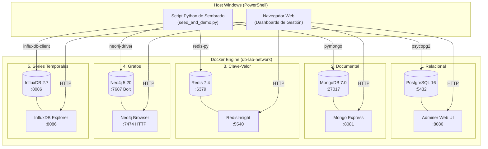

# 🚀 Laboratorio Multi-Paradigma de Bases de Datos (Docker & Python)

[](https://www.docker.com/)
[](https://www.python.org/)
[](https://microsoft.com/powershell)
[](LICENSE)

Laboratorio práctico DevOps y Full-Stack diseñado para desplegar, sembrar y analizar los **5 paradigmas principales de bases de datos** mediante contenedores Docker con persistencia local y dashboards web visuales integrados.

---

## 📊 Matriz Comparativa de Paradigmas

| Paradigma | Motor | Concepto Pedagogico Clave | Caso de Uso para la Clase | Dashboard Web | Puerto Motor |
| :--- | :--- | :--- | :--- | :--- | :--- |
| **Relacional (SQL)** | **PostgreSQL 16** | Tablas estrictas e integridad referencial (ACID) | Transacciones de Usuarios y Pedidos vinculados | [Adminer](http://localhost:8080) (`:8080`) | `5433` (host) / `5432` |
| **Documental (NoSQL)** | **MongoDB 7.0** | **Objetos que van mutando** (Schema Evolution) | Clientes cuyas versiones agregan campos sin `ALTER TABLE` | [Mongo Express](http://localhost:8081) (`:8081`) | `27017` |
| **Clave-Valor** | **Redis 7.4** | **Recuperar datos puntuales** en RAM ($O(1)$) | Sesiones por Token, Flags globales y Contadores | [RedisInsight](http://localhost:5540) (`:5540`) | `6379` |
| **Grafos** | **Neo4j 5.20** | **Mini Red Social** (Relaciones de 1er nivel) | Amigos, Likes y Algoritmo "Amigos de mis amigos" | [Neo4j Browser](http://localhost:7474) (`:7474`) | `7687` (Bolt) |
| **Series Temporales / Columnar** | **InfluxDB 2.7** | **Muchos datos para analizar** (Estilo BigQuery) | Analitica masiva y agregaciones temporales de telemetria | [InfluxDB Web UI](http://localhost:8086) (`:8086`) | `8086` |

---

## 🏛 Arquitectura del Laboratorio



---

## ⚡ Guía de Ejecución Rápida en PowerShell

### 1. Clonar el Repositorio
```powershell
git clone https://github.com/MarcosGurruchaga/database-paradigms-lab.git
cd database-paradigms-lab
```

### 2. Levantar la Infraestructura con Docker
Asegúrate de que Docker Desktop esté en ejecución y ejecuta:

```powershell
# Levantar todos los contenedores en segundo plano
docker compose up -d

# Verificar el estado de los contenedores
docker compose ps
```

*O usando el script de conveniencia:*
```powershell
.\run.ps1 up
```

---

### 3. Preparar el Entorno Python y Dependencias
```powershell
# Crear y activar el entorno virtual
python -m venv .venv
.\.venv\Scripts\Activate.ps1

# Instalar los drivers requeridos
pip install -r requirements.txt
```

---

### 4. Ejecutar el Sembrado y Demostración
El script `seed_and_demo.py` conecta a cada base de datos con reintentos automáticos, inserta los datos de prueba y ejecuta consultas analíticas representativas con salida formateada en terminal:

```powershell
# Ejecutar demostración completa (los 5 motores)
python seed_and_demo.py

# O ejecutar sólo un motor específico si lo deseas:
# python seed_and_demo.py --engine postgres
# python seed_and_demo.py --engine mongodb
# python seed_and_demo.py --engine redis
# python seed_and_demo.py --engine neo4j
# python seed_and_demo.py --engine influxdb
```

*O simplemente:*
```powershell
.\run.ps1 seed
```

---

### 5. Acceder a las Interfaces Visuales en el Navegador

Puedes abrir todos los dashboards simultáneamente con:
```powershell
.\run.ps1 open-dashboards
```

O acceder manualmente:

| Servicio | URL | Credenciales / Configuración |
| :--- | :--- | :--- |
| **PostgreSQL (Adminer)** | [http://localhost:8080](http://localhost:8080) | Servidor: `postgres` \| Usuario: `postgres` \| Clave: `postgrespassword` \| DB: `lab_sql` |
| **MongoDB (Mongo Express)** | [http://localhost:8081](http://localhost:8081) | Acceso directo (Basic Auth deshabilitado para desarrollo local) |
| **Redis (RedisInsight)** | [http://localhost:5540](http://localhost:5540) | Host: `redis` (o `localhost`) \| Puerto: `6379` \| Clave: `redispassword` |
| **Neo4j (Browser)** | [http://localhost:7474](http://localhost:7474) | Conexión: `bolt://localhost:7687` \| Usuario: `neo4j` \| Clave: `neo4jpassword` |
| **InfluxDB (Web UI)** | [http://localhost:8086](http://localhost:8086) | Usuario: `influxadmin` \| Clave: `influxpassword123` \| Org: `devops-lab` |

---

### 6. Detención y Limpieza

Para detener los servicios sin perder datos:
```powershell
docker compose down
# o con el script:
.\run.ps1 down
```

Para detener los servicios y **eliminar por completo los volúmenes persistidos locales (`./data`)**:
```powershell
.\run.ps1 clean
```

---

## 📁 Estructura del Proyecto

```text
c:\no-sql\
├── .gitignore                      # Ignora datos binarios, venv y credenciales
├── .env.example                    # Plantilla de variables de entorno
├── docker-compose.yml              # Definición de 5 motores + 5 interfaces web
├── requirements.txt                # Dependencias de Python (drivers + rich)
├── seed_and_demo.py                # Script de sembrado y verificación funcional
├── run.ps1                         # Automatizador integral en PowerShell
├── README.md                       # Documentación principal
└── modules/                        # Guías conceptuales detalladas por motor
    ├── 01-relational-postgres/README.md
    ├── 02-document-mongodb/README.md
    ├── 03-keyvalue-redis/README.md
    ├── 04-graph-neo4j/README.md
    └── 05-timeseries-influxdb/README.md
```

---

## 🧑‍💻 Autor
**Marcos Gurruchaga** - *DevOps & Full-Stack Engineer*
